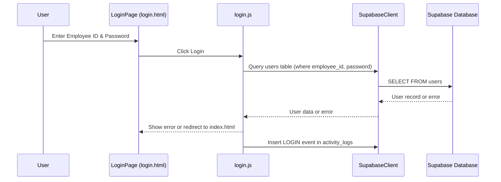
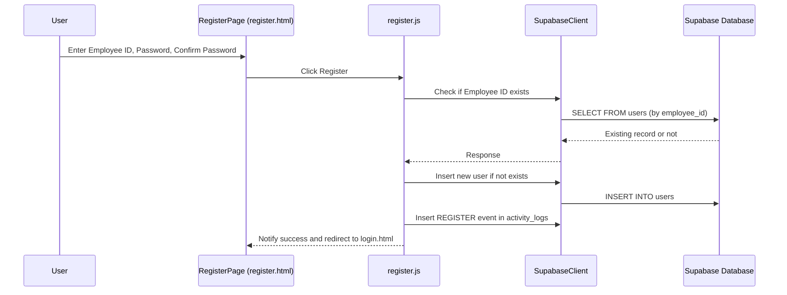
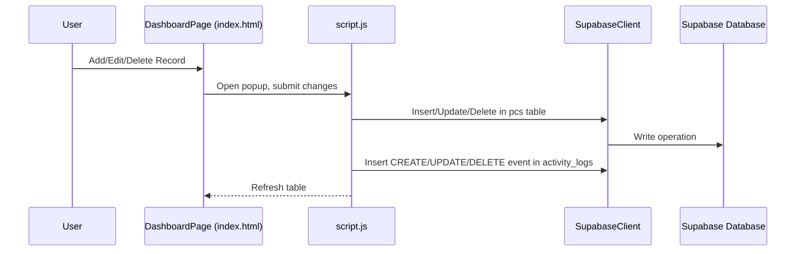
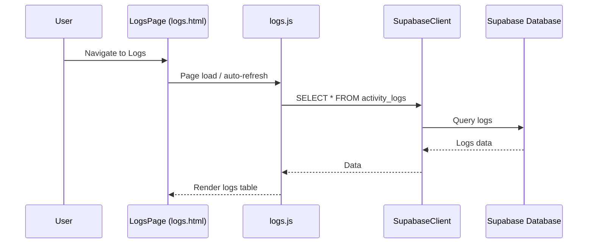

# PC Deployment Dashboard Feature Documentation

## Overview

The **PC Deployment Dashboard** is a web application designed to manage the registration, authentication, and tracking of PC deployment activities within an organization. It enables IT staff to log in securely, add new PC deployment records, edit or delete existing records, and view all activities through comprehensive logs. The dashboard provides a convenient interface for both administrative and tracking purposes, ensuring transparency and accountability in device management.

Key user flows include staff registration, login/logout, managing PC deployment records, and viewing activity logs. All activities are tracked and logged for audit purposes. The application relies on Supabase as its backend for data storage and authentication.


## Component Structure

### 1. Presentation Layer

#### **Login Page** (`login.html`)
- Provides a form for employees to log in using their Employee ID and password.
- Displays error messages and links to registration for new users.
- On login, redirects to the main dashboard (`index.html`).

#### **Register Page** (`register.html`)
- Allows new users to create an account by providing an Employee ID and password (with confirmation).
- Displays validation errors and success notifications.
- On success, redirects to the login page.

#### **Main Dashboard Page** (`index.html`)
- Presents a searchable and sortable table of all PC deployment records.
- Offers options to add new records and edit/delete existing ones via popup dialogs.
- Displays the current user's ID and provides a logout option.

#### **Logs Page** (`logs.html`)
- Shows an activity log table with all significant actions (login, registration, CRUD operations).
- Refreshes automatically every 30 seconds to show recent activity.

#### **Sidebar** (`sidebar.js`)
- Provides navigation links to dashboard and logs, displays logged-in user's ID, and includes an accessible logout button.


### 2. Business Layer

#### **Authentication Logic** (`login.js`, `register.js`)
- Handles user login validation, session management, and registration.
- Logs all authentication-related activities to the database.

#### **PC Management Logic** (`script.js`)
- Manages CRUD operations for PC deployment records.
- Handles edit/add popups, table sorting, and searching.
- Logs all changes for auditability.

#### **Logs Logic** (`logs.js`)
- Fetches and displays activity logs for auditing.
- Handles periodic refreshing of activity data.


### 3. Data Access Layer

#### **Supabase Client** (`supabase-js`)
- Used in all business logic files to interact directly with Supabase tables:
  - `users` (authentication)
  - `pcs` (PC deployment records)
  - `activity_logs` (activity tracking)


### 4. Data Models

#### **User Model** (`users` table)

| Property      | Type   | Description                 |
|---------------|--------|-----------------------------|
| employee_id   | string | Unique ID for each employee |
| password      | string | User's password             |

#### **PC Deployment Model** (`pcs` table)

| Property       | Type    | Description                    |
|----------------|---------|--------------------------------|
| id             | int     | Unique row ID (auto-increment) |
| plant          | string  | Plant location                 |
| department     | string  | Department name                |
| old_pc_name    | string  | Old PC name                    |
| old_serial     | string  | Old PC serial number           |
| new_pc_name    | string  | New PC name                    |
| new_serial     | string  | New PC serial number           |
| ipv4           | string  | IPv4 address                   |
| status         | string  | Deployment status              |

#### **Activity Log Model** (`activity_logs` table)

| Property      | Type      | Description                        |
|---------------|-----------|------------------------------------|
| id            | int       | Unique log entry ID                |
| employee_id   | string    | Employee ID who performed action   |
| action        | string    | Action type (LOGIN, UPDATE, etc.)  |
| details       | string    | Action details                     |
| created_at    | timestamp | Date and time of the action        |


## Feature Flows

### 1. User Login Flow



### 2. Registration Flow



### 3. PC Record CRUD Flow



### 4. Viewing Activity Logs




## State Management

- **Loading**: While fetching data from Supabase (e.g., activity logs or PC records), tables display loading messages.
- **Defined**: Once fetched, data is rendered in tables.
- **Error**: Error messages are shown on failed operations (e.g., login errors, failed record updates).
- **Empty**: If no records exist, a placeholder row communicates the empty state.


## Integration Points

- All business logic interacts directly with Supabase via the JS SDK.
- The sidebar is embedded in every main page for navigation and logout.


## Analytics & Tracking

- Every significant user action (LOGIN, LOGOUT, REGISTER, CREATE, UPDATE, DELETE) is logged to the `activity_logs` table.
- Each log entry captures the user (employee_id), type of action, and details.


## Key Classes Reference

| Class/Script        | Location           | Responsibility                                                        |
|---------------------|-------------------|-----------------------------------------------------------------------|
| login.js            | login.js          | Handles authentication and login event logging                        |
| register.js         | register.js       | Handles user registration and registration event logging              |
| script.js           | script.js         | Manages the main dashboard: PC CRUD, logging, UI popups              |
| logs.js             | logs.js           | Fetches and displays activity logs                                    |
| sidebar.js          | sidebar.js        | Renders the sidebar and manages navigation/logout                     |
| SupabaseClient      | All JS files      | Data access for users, pcs, activity_logs via Supabase                |


## Error Handling

- Errors are caught and displayed to users via UI (e.g., error messages on login or registration).
- Console errors are logged for debugging.
- All CRUD and authentication operations are wrapped in try/catch blocks.

**Example: Displaying an error during registration**

```js
function showError(text) {
  elements.errorMsg.textContent = text;
  elements.errorMsg.style.color = "#ff4d4d";
}
```


## Caching Strategy

- No local data caching is implemented; all data is fetched in real time from Supabase.
- Activity logs auto-refresh every 30 seconds to keep data up to date.


## Dependencies

- [Supabase JS SDK](https://supabase.com/) (`@supabase/supabase-js@2`)
- No other third-party libraries are used.


## API Integration

### Authentication: User Login

#### POST /users (check login)

```api
{
    "title": "User Login",
    "description": "Validates an employee's credentials and logs login event.",
    "method": "POST",
    "baseUrl": "https://fllgcdidreolzabsnkrh.supabase.co",
    "endpoint": "/rest/v1/users?select=*&employee_id=eq.{employee_id}&password=eq.{password}",
    "headers": [
        { "key": "apikey", "value": "<SUPABASE_KEY>", "required": true },
        { "key": "Authorization", "value": "Bearer <SUPABASE_KEY>", "required": true }
    ],
    "queryParams": [
        { "key": "employee_id", "value": "Employee ID for login", "required": true },
        { "key": "password", "value": "User password", "required": true }
    ],
    "pathParams": [],
    "bodyType": "none",
    "requestBody": "",
    "responses": {
        "200": {
            "description": "Login success, user found.",
            "body": "{\n  \"employee_id\": \"john01\",\n  \"password\": \"mypassword\"\n}"
        },
        "400": {
            "description": "Missing parameters.",
            "body": "{\n  \"error\": \"Employee ID and password required.\"\n}"
        },
        "404": {
            "description": "Invalid credentials.",
            "body": "{\n  \"error\": \"Invalid Employee ID or Password.\"\n}"
        }
    }
}
```

---

### Authentication: Register New User

#### POST /users (register)

```api
{
    "title": "Register User",
    "description": "Registers a new employee and logs the registration event.",
    "method": "POST",
    "baseUrl": "https://fllgcdidreolzabsnkrh.supabase.co",
    "endpoint": "/rest/v1/users",
    "headers": [
        { "key": "apikey", "value": "<SUPABASE_KEY>", "required": true },
        { "key": "Authorization", "value": "Bearer <SUPABASE_KEY>", "required": true }
    ],
    "queryParams": [],
    "pathParams": [],
    "bodyType": "json",
    "requestBody": "{\n  \"employee_id\": \"john01\",\n  \"password\": \"mypassword\"\n}",
    "responses": {
        "201": {
            "description": "Registration successful.",
            "body": "{\n  \"employee_id\": \"john01\",\n  \"password\": \"mypassword\"\n}"
        },
        "400": {
            "description": "Employee ID already exists.",
            "body": "{\n  \"error\": \"This Employee ID is already registered.\"\n}"
        }
    }
}
```


### PC Records: Get All

#### GET /pcs

```api
{
    "title": "Get PC Records",
    "description": "Fetches all PC deployment records.",
    "method": "GET",
    "baseUrl": "https://fllgcdidreolzabsnkrh.supabase.co",
    "endpoint": "/rest/v1/pcs?select=*",
    "headers": [
        { "key": "apikey", "value": "<SUPABASE_KEY>", "required": true },
        { "key": "Authorization", "value": "Bearer <SUPABASE_KEY>", "required": true }
    ],
    "queryParams": [],
    "pathParams": [],
    "bodyType": "none",
    "requestBody": "",
    "responses": {
        "200": {
            "description": "List of PC deployment records.",
            "body": "[\n  { \"id\": 1, \"plant\": \"HQ\", ... }\n]"
        }
    }
}
```


### PC Records: Create

#### POST /pcs

```api
{
    "title": "Add New PC Record",
    "description": "Adds a new PC deployment record and logs the creation.",
    "method": "POST",
    "baseUrl": "https://fllgcdidreolzabsnkrh.supabase.co",
    "endpoint": "/rest/v1/pcs",
    "headers": [
        { "key": "apikey", "value": "<SUPABASE_KEY>", "required": true },
        { "key": "Authorization", "value": "Bearer <SUPABASE_KEY>", "required": true }
    ],
    "queryParams": [],
    "pathParams": [],
    "bodyType": "json",
    "requestBody": "{\n  \"plant\": \"HQ\",\n  \"department\": \"IT\",\n  \"old_pc_name\": \"PC-001\",\n  \"old_serial\": \"1234\",\n  \"new_pc_name\": \"PC-002\",\n  \"new_serial\": \"5678\",\n  \"ipv4\": \"192.168.1.10\",\n  \"status\": \"Not Replaced\"\n}",
    "responses": {
        "201": {
            "description": "PC record created.",
            "body": "{\n  \"id\": 15, ...\n}"
        },
        "400": {
            "description": "Invalid input.",
            "body": "{\n  \"error\": \"Invalid data.\"\n}"
        }
    }
}
```


### PC Records: Update

#### PATCH /pcs

```api
{
    "title": "Update PC Record",
    "description": "Updates a PC deployment record and logs the update.",
    "method": "PATCH",
    "baseUrl": "https://fllgcdidreolzabsnkrh.supabase.co",
    "endpoint": "/rest/v1/pcs?id=eq.{id}",
    "headers": [
        { "key": "apikey", "value": "<SUPABASE_KEY>", "required": true },
        { "key": "Authorization", "value": "Bearer <SUPABASE_KEY>", "required": true }
    ],
    "queryParams": [
        { "key": "id", "value": "PC record ID", "required": true }
    ],
    "pathParams": [],
    "bodyType": "json",
    "requestBody": "{\n  \"plant\": \"HQ\",\n  \"department\": \"IT\",\n  ...\n}",
    "responses": {
        "200": {
            "description": "PC record updated.",
            "body": "{\n  \"id\": 15, ...\n}"
        },
        "404": {
            "description": "Record not found.",
            "body": "{\n  \"error\": \"No matching record.\"\n}"
        }
    }
}
```


### PC Records: Delete

#### DELETE /pcs

```api
{
    "title": "Delete PC Record",
    "description": "Deletes a PC deployment record and logs the deletion.",
    "method": "DELETE",
    "baseUrl": "https://fllgcdidreolzabsnkrh.supabase.co",
    "endpoint": "/rest/v1/pcs?id=eq.{id}",
    "headers": [
        { "key": "apikey", "value": "<SUPABASE_KEY>", "required": true },
        { "key": "Authorization", "value": "Bearer <SUPABASE_KEY>", "required": true }
    ],
    "queryParams": [
        { "key": "id", "value": "PC record ID", "required": true }
    ],
    "pathParams": [],
    "bodyType": "none",
    "requestBody": "",
    "responses": {
        "200": {
            "description": "PC record deleted.",
            "body": "{\n  \"id\": 15, ...\n}"
        },
        "404": {
            "description": "Record not found.",
            "body": "{\n  \"error\": \"No matching record.\"\n}"
        }
    }
}
```


### Activity Logs: Fetch All

#### GET /activity_logs

```api
{
    "title": "Get Activity Logs",
    "description": "Fetches activity log entries for auditing.",
    "method": "GET",
    "baseUrl": "https://fllgcdidreolzabsnkrh.supabase.co",
    "endpoint": "/rest/v1/activity_logs?select=*",
    "headers": [
        { "key": "apikey", "value": "<SUPABASE_KEY>", "required": true },
        { "key": "Authorization", "value": "Bearer <SUPABASE_KEY>", "required": true }
    ],
    "queryParams": [],
    "pathParams": [],
    "bodyType": "none",
    "requestBody": "",
    "responses": {
        "200": {
            "description": "List of activity logs.",
            "body": "[\n  { \"id\": 1, \"employee_id\": \"john01\", \"action\": \"LOGIN\", ... }\n]"
        }
    }
}
```


## UI States

- **Login/Register:** Shows loading, error, and success states.
- **Dashboard Table:** Supports loading, empty, and sorted states.
- **Popups:** Used for editing and adding records, overlaid on dashboard.
- **Logs Table:** Shows loading, no records, and auto-refreshes.


## Testing Considerations

- Attempt login with invalid credentials, check for error display.
- Register with an existing Employee ID, expect failure.
- Add, edit, and delete PC records, verify table updates and logs.
- Edit or delete non-existent records, expect error handling.
- Check activity logs auto-refresh and correct action recording.
- Test logout from both main dashboard and sidebar.


```card
{
    "title": "All actions are logged",
    "content": "Every authentication and PC record operation is logged in detail for audit purposes."
}
```

```card
{
    "title": "Session handling",
    "content": "LocalStorage is used to store login state and employee ID; session is cleared on logout."
}
```

```card
{
    "title": "Supabase as backend",
    "content": "All authentication, data storage, and activity logging use the Supabase cloud platform."
}
```


**End of Documentation**
